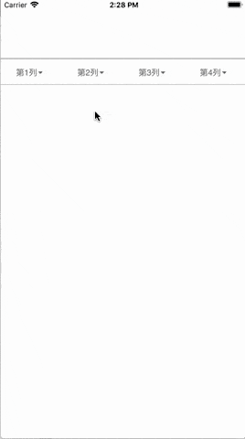

# XYXFilterMenu_Swift
基于之前用Objective-C写的筛选菜单，使用Swift4改写的。废弃了三联筛选方式。

    现在的样式比较固定，分别为单列TableView，双列TableView，带清空和确认按钮的CollectionView；
    TableView模式都是单选页面，CollectionView模式是多选页面；
    可以指定任意菜单下页面的样式；
    可以指定TableView页面的灰色区域高度；
    可以便捷地对一些展示样式进行编辑；
    可以任性的将menu放在屏幕指定位置；
    
 DEMO效果如下：


###调用方法也很简单：
```Swift 4.0
let menu = XYXFilterMenu.init(frame: CGRect(x: 0, y: 100, width: XYX_SCREEN_WIDTH, height: 44))
menu.dataSource = self
menu.delegate = self
self.view.addSubview(menu)
```
只需要像这样写四行，然后实现一些必要的协议就行了。具体协议，请下载Demo自行参考。
